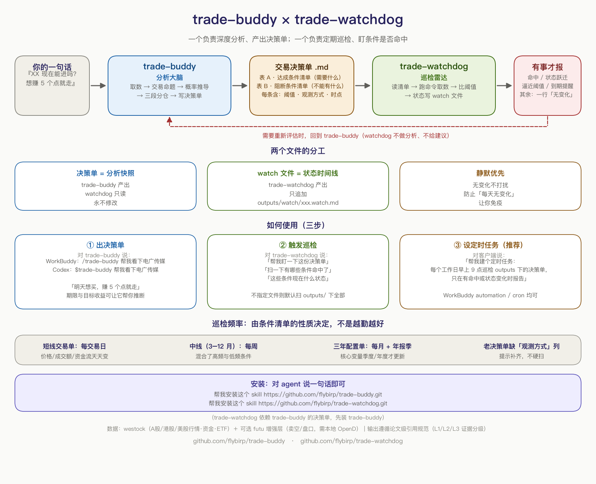

# trade-buddy

<p align="center">
  
</p>

<p align="center">
  <b>交易搭档</b> · v1.0.0 · 分类：投资理财 · Author: flybirp
</p>

把自己一句模糊的买入想法，变成一张**可验证、可执行、可复盘**的交易决策单。

> 研究员负责找逻辑，交易员负责定计划，风控负责限制亏损，复盘员负责迭代。

它不是诊股器，不承诺预测准确，也不劝你买或卖。它做的是：**把「我觉得能涨」拆成一句话可证伪的命题，再用真实数据去支撑或推翻它**。



上图是完整生态：trade-buddy 负责深度分析、产出决策单；配套的 [trade-watchdog](https://github.com/flybirp/trade-watchdog) 负责定期巡检条件是否命中，无变化保持静默。

---

## 为什么需要它

LLM 做投资分析有三个结构性缺陷，这个 skill 逐个堵：

| 缺陷 | 表现 | 本 skill 的处理 |
|---|---|---|
| **幻觉** | 结论里塞进「行业常识」数字，查无出处 | 论文级引用规范：每个关键数据必须挂 `[n]`，五要素齐全，**无引用的数据不许进决策单** |
| **轻信传闻** | 「在手订单 15 亿」照单全收 | **证据分级 L1/L2/L3**，L3 传闻隔离进「待验证线索」表，禁止进入概率模型 |
| **拍脑袋概率** | 「成功率 63%」 | 概率必须给区间（单档宽度 ≥10pct）、基础锚、证据修正、不确定性折扣、置信度 |

它还堵了两个执行层的坑：

- **取数无预算**：不设闸门就会无限铺开。硬性限定横向扫描 ≤8 只、深度挖掘 ≤3 只。
- **框架错配**：把 A 股的涨跌停逻辑套到港股（无涨跌停、T+0），炸板率、连板高度全部失效。已按市场前缀分流。

---

## 快速开始

### 安装

**方式一：一句话安装（最省事）**

在 WorkBuddy / CodeBuddy / Codex 里直接把这句话发给 agent：

```
帮我安装这个 skill https://github.com/flybirp/trade-buddy.git
```

agent 会自动 clone 到你当前客户端的 skills 目录。按各客户端的安全策略，它可能先跑一遍安全审查，确认即可。装完**重启客户端**生效。

**方式二：skills CLI**

```bash
npx skills add flybirp/trade-buddy -g -y
```

`-g` 表示装到用户级（所有项目可用）。若 CLI 装到了 `~/.agents/skills/`，手动链接到你的客户端目录即可：

```bash
ln -s ~/.agents/skills/trade-buddy ~/.workbuddy/skills/trade-buddy
```

**方式三：git clone / 手动复制**

```bash
# WorkBuddy
git clone https://github.com/flybirp/trade-buddy.git ~/.workbuddy/skills/trade-buddy

# CodeBuddy
git clone https://github.com/flybirp/trade-buddy.git ~/.codebuddy/skills/trade-buddy

# OpenAI Codex CLI
git clone https://github.com/flybirp/trade-buddy.git ~/.codex/skills/trade-buddy
```

手动复制同理：把整个 `trade-buddy/` 目录放进客户端的 `skills/` 下。**目录里必须有 `SKILL.md`**，否则不会被识别。

可选依赖（仅在使用富途增强层时需要）：

```bash
pip install futu-api
```

### 安全性

这个 skill **只有一个 Python 脚本**，且行为是只读的：

- 不执行任意命令、不写文件、不删文件
- 唯一网络出口是 `socket` 连接本机 `127.0.0.1:11111`（富途 OpenD），**不外传任何数据**
- 不读取 SSH / 环境变量 / 凭据等敏感本机文件

其余全部是 Markdown 文档。你可以让 agent 用 `skill-vetter` 之类的审查工具再验一遍。

### 验证安装

重启客户端后，用对应客户端的唤醒方式问一句：

| 客户端 | 唤醒方式 |
|---|---|
| WorkBuddy | `/trade-buddy 帮我看下茅台现在能进吗` |
| Codex | `$trade-buddy 帮我看下茅台现在能进吗` |

能输出决策单即安装成功。如果客户端找不到这个 skill，检查 `SKILL.md` 的 frontmatter 是否完整（`name` + `description` 必填）。

### 怎么触发

两种都行：

- **直接说人话**：`帮我看下电广传媒，明天想买，赚 5 个点就走` —— 客户端会自动匹配
- **显式调用**：WorkBuddy 用 `/trade-buddy`，Codex 用 `$trade-buddy`

**只有两个信息会向你追问**：持有期限、目标收益率。其余（标的身份、当前价、财务、公告、同业、板块）全部自己取数补全——不会问你能自己查到的东西。

---

## 五个 query 样例

### 1. A 股个股，参数最完整（最高频用法）

```
帮我看下电广传媒，明天开盘想买，赚 5 个点就走
```

会做：日/周K + 资金 + 龙虎榜 + 筹码 + 财务 + 公告 + 同业 + 板块 → 收敛成一句可证伪的命题 → 次日高开/平开/低开情景树 → 三段分仓

你会拿到：一句话结论（执行/等确认/放弃/建议换标的）、达成与止损的概率区间、每笔仓位的触发条件与失效位、止盈止损时间退出。

### 2. 给主题让我挑标的（横向扫描）

```
帮我挑个商业航天的好标的，带上建仓和持仓计划，目标 1 年内翻倍
```

会做：横向扫描 ≤8 只（只用周K + 市值 + PE 排序淘汰）→ 胜出 ≤3 只才做深度挖掘 → 同业比较表 → 判断保留还是换标的

你会拿到：一张同业对比表（业务纯度/业绩质量/估值赔率/催化/技术位置），以及**对你目标收益率的诚实校准**——如果「1 年翻倍」在当前位置只有 8%–15% 概率，它会直接告诉你，而不是顺着你的乐观给结论。

### 3. 港股 / 港股通

```
金山软件港股值得买吗，期望 10%，需要多久，多大概率
```

会做：走 `hk-connect` 分支 —— 先校验标的是否在港股通名单、拉南下资金持股变动、按 T+0 改写为**当日**情景树、删除炸板率/连板高度等涨跌停类字段、把 0.3%–0.5% 双边成本计入目标收益

你会拿到：不同期限下的达成概率矩阵（1/3/6/12 个月）、每手股数与最小建仓金额、汇率风险提示。

### 4. 美股

```
NVDA 现在能进吗？打算持有 3 个月，目标 20%
```

会做：美元计价、T+0、无涨跌停；注意盘中数据时区错配（A 股时段看到的不是实时价）

你会拿到：与 A 股同源的分析框架，但所有涉及涨跌停的字段自动关闭，成本模型换成美股口径。

### 5. 持仓诊断与复盘（不只是买入）

```
我上周 8.2 买了 XX，现在 7.6，该止损还是加仓
```

会做：走第 7 步跟踪流程 —— 检查当初的催化是否已兑现或证伪、哪些情景条件已触发、概率如何调整

你会拿到：继续/加仓/减仓/退出/换标的的明确建议，以及**归因结论**：这单错在选股、择时、仓位还是执行。

### 进阶：你自己带线索来，它负责证伪

```
我觉得 XX 被低估了，他们上个月中标了 Y 项目，订单应该有 15 亿
```

这条会触发**用户非共识假设审计**：把你的说法改写成可检验命题，然后按事实层 / 归因层 / 定价层 / 反证层四层验证，输出五种状态之一。

**验证通过的线索**才能进入交易命题和概率模型；验证不通过的会进「待验证线索」表，并写明下一个能证实或证伪它的事件节点——不会被当成既成事实。

---

## 核心机制

### 一句话交易命题

```
买入这只股票，本质是在押注 ______ 在 ______ 时间内尚未被充分定价。
```

必须可证伪。禁止「受益于行业发展」「可能有资金关注」这类空话。

### 四类结论

`执行` / `等确认` / `放弃` / `建议换标的` —— 只有这四种，且必须附理由、数据缺口与 Reference。

### 证据分级

| 等级 | 来源 | 允许用途 |
|---|---|---|
| **L1** | 公告原文、定期报告、监管文件、结构化行情/财务接口 | 可进交易命题、概率模型 |
| **L2** | 券商研报、权威财经媒体、机构一致预期 | 可进证据修正 |
| **L3** | 自媒体、投资者互动平台、「据第三方测算」、无公告确认的订单/份额 | **仅作待验证线索，不得进概率模型** |

### 概率三档

`达成目标` / `先触发失效` / `横盘未完成`，合计约 100%。禁止「成功率 63%」这种伪精确。

### 三段式分仓

`试错仓 20–30%` / `确认仓 30–40%` / `加强仓 剩余`，每笔绑定触发条件、预计成本、失效位、账户风险。仓位由风险预算和止损距离反推，不由信心决定。

### 达成/阻断条件清单

决策单必含两张表：**达成条件清单**（目标需要什么）与**阻断条件清单**（目标不能有什么）。每条绑定可观测指标、阈值、观测时点、观测方式（自动命令 / 人工来源 / 不可观测）。概率由这两张表推导，不是感觉出来的。

条件清单写完会沉睡？配套 [trade-watchdog](https://github.com/flybirp/trade-watchdog) —— 定期巡检这些条件是否命中、是否逼近阈值，无变化保持静默。

---

## 目录结构

```
trade-buddy/
├── SKILL.md                          主入口：工作流、硬规则、Verification 清单
├── README.md
├── LICENSE                           MIT
├── references/
│   ├── research-pipeline.md          取数口径、来源优先级、时点定义
│   ├── catalyst-and-peers.md         催化剂评级、同业龙头、是否换标的
│   ├── probability-calibration.md    概率区间如何校准
│   ├── execution-playbook.md         情景树与分仓（A 股路径）
│   ├── hk-connect.md                 港股/港股通适配（hk 前缀必读）
│   └── futu-datasource.md            富途增强层（需本地 OpenD）
├── scripts/
│   └── futu_quote.py                 富途行情适配 CLI
├── templates/
│   └── trade-decision-card.md        决策单模板
└── assets/
    └── logo-512.png                  技能头像（512×512）
```

> reference 一律**按需加载**：开场只读 template，其余在对应阶段卡壳时才读。决策要点已内联进 SKILL.md。

---

## 数据源

| 层 | 用途 | 说明 |
|---|---|---|
| **主**：WeStock Data（腾讯自选股） | K线、分时、技术指标、资金、龙虎榜、筹码、财报、股东、分红、板块 | A股/港股/美股，支持逗号分隔批量 |
| **增强**：富途 `futu-api` + OpenD | **卖空数据**、每手股数、实时市值、盘口逐笔、机构持仓 | 条件启用；需本地 OpenD，不可用则整层跳过 |
| **公告**：巨潮 cninfo（A股）、**HKEXnews 披露易**（港股） | 一手公告原文 | L1 证据源 |
| **行业**：WebSearch / agentic_search | 景气度、产业链、政策、反向证据 | 委派时必须限定输出范围 |
| **新闻**：tencent-news | 催化剂新鲜度校验 | L2 |

**已知无效调用已列表固化**（`quote` 不可用、`search --sector` 对中文板块名无效、`reserve` 返回空壳、港股 `chip`/`lhb` 不支持、futu-api 会无限重连），避免重复踩坑。

### 在 Codex / CodeBuddy 上数据源可用吗？

**可用，而且不需要装任何东西。** 数据源分两层：

- **公开 CLI 层（跨客户端通用）**：westock 的实体是公开 npm 包 `westock-data-clawhub@1.0.4`（registry.npmjs.org），只要本机有 Node.js ≥16，直接 `npx -y westock-data-clawhub@1.0.4 kline sz001270` 就能取数——K线、资金、财报、筹码、ETF、港股通持股全覆盖。**WorkBuddy 里的「WeStock Data」skill 只是这个 CLI 的文档壳，没有它 ≠ 没有数据源。**
- **WorkBuddy 专属 skill 层（Codex 上没有，自动降级）**：`tencent-news` / `cninfo-stock-data` / `agentic_search` / `量能异动监控`。降级路径：新闻与行业检索 → WebSearch；A股公告 → WebFetch 巨潮资讯网；港股公告 → WebFetch 港交所披露易（HKEXnews）；量能 → westock `kline` 原始量价自行计算。降级取的数据在「数据缺口」标注未交叉验证。

> 症状对照：如果你看到 agent 提示「本机没有预装的 westock/cninfo CLI」然后翻找插件缓存——那是误判，让它直接跑上面的 `npx` 命令即可。公告类接口在 Codex 上确实没有 CLI（cninfo 是 WorkBuddy 私有 skill），走 WebFetch 官网。

可选的 futu 增强层：`pip install futu-api` + 本地 OpenD，随本仓库自带 `scripts/futu_quote.py`，先 `probe` 再调用，不可用自动跳过。

---

## 市场支持

| 前缀 | 市场 | 关键差异处理 |
|---|---|---|
| `sh` `sz` `bj` | A 股 | T+1、有涨跌停、人民币 |
| **`hk`** | **港股 / 港股通** | T+0（情景树改为「当日」而非「次日」）、**无涨跌停**（删除炸板率/连板高度/隔日溢价字段）、港币报价人民币交收、成本 0.3–0.5%、须校验港股通资格、南下资金持股是独家信号 |
| `us` | 美股 | 美元、T+0、时区错配 |
| **`pt`** | **行业板块** | 板块 ≈ 无财报的行业指数：套用指数五维框架 + 板块专用通道（`board` 全市场涨幅排名 / `hot board` 热度与代码 / `kline pt…` 历史区间 / 行业 ETF 代理）。板块估值分位与业绩汇总无接口，降级券商研报并标注数据缺口 |

**板块轮动类 query**（如「3 个月内哪个板块涨幅最高」）按三步转译：`board`/`hot board` 批量初筛（不受 ≤8 只预算限制，那条约束的是个股深度挖掘）→ 每个候选板块做「进入前 3 名」的简化条件表 → 输出相对排序 + 并列概率区间，禁止单一板块伪精确胜率。

港股还有两个容易踩的坑，已在 `hk-connect.md` 固化：

1. **市值要反推**：港股 `profile` 不返回 `regCapital`，用 `ProfitToShareholders ÷ BasicEPS` 估算股本。
2. **财报要看三层口径**：归母净利 / 经营溢利 / Non-IFRS 经调整净利，并用经营现金流交叉验证。控股平台型公司常出现「合营公司权益收益」把表观净利推高——实测某标的归母净利 +101%，但经营溢利 -17%、经调整净利 -13%、经营现金流 -48.8%，表观 PE 10.5 倍实际约 25 倍。

---

## 输出

`outputs/{{标的}}交易决策单-{{YYYYMMDD}}.md`，结构：

```
一句话结论 → 交易命题（可证伪）→ 关键事实（带 [n] + 证据等级）
→ 反向证据 / 待验证线索(L3) / 数据缺口 → 催化·行业·同业
→ 目标收益可达性（概率三档 + 置信度 + 最大不确定性）
→ 建仓持仓计划（三段分仓 + 情景树 + 止盈止损时间退出）
→ 盘中验证点 → 最大风险 → 引用自检 → References
```

默认 Markdown。只有用户明确要求时才生成 HTML/网页版。

---

## 一个真实案例（为什么「防幻觉」不是口号）

分析某商业航天标的时，正文初稿的结论句写的是：

> 「……星网份额 80%、千帆 60%……」

按引用规范反向扫描时发现：**这两个数字只出现在自媒体财富号和转载稿里，公司财报和公告从未披露**。已从结论中移除，隔离进「待验证线索」表，并补充了 3 条漏引来源。

同类问题还有：「在手订单超 15 亿」来自「据第三方信息及机构测算」，而机构一致预期当年营收只有 5.49 亿——**两者直接矛盾**。这类交叉验证是这个 skill 的强制动作。

---

## 免责声明

本 skill 输出的内容基于公开数据，仅供参考，**不构成投资建议**。市场有风险，投资需谨慎。任何投资决策应结合个人风险承受能力、资金状况和投资目标独立判断，必要时咨询持牌专业机构。过往表现不预示未来收益。

## License

MIT
